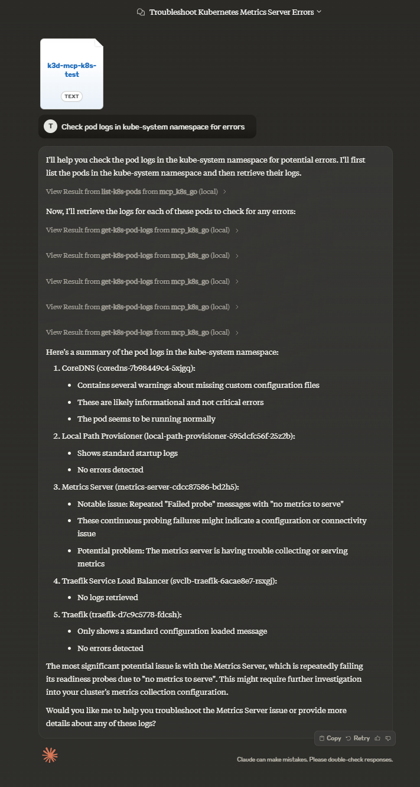

# MCP K8S Go

This project is intended as a both MCP server connecting to Kubernetes and a library to build more servers for any custom resources in Kubernetes.

Currently available:
- resource: K8S contexts as read from kubeconfig configurations
- tool: list-k8s-contexts
- tool: list-k8s-namespaces in a given context
- tool: list-k8s-pods in a given context and namespace
- tool: list-k8s-events in a given context and namespace
- tool: list-k8s-services in a given context and namespace
- tool: get-k8s-pod-logs in a given context and namespace

## Example usage with Inspector

To use latest published version with Inspector you can run this:

```bash
npx @modelcontextprotocol/inspector npx @strowk/mcp-k8s
```

, or to use version built from sources, then in root folder of this project:

```bash
tools/inspector/run.sh
```

## Example usage with Claude Desktop

To use this MCP server with Claude Desktop you would firstly need to install it.

You have several options for installation:

1. Using mcp-get (recommended):
```bash
npx @michaellatman/mcp-get@latest install @strowk/mcp-k8s
```

2. Using pre-built binaries published in npm or building from source.

### Using pre-built binaries

#### From npm

Use this if you have npm installed and want to use pre-built binaries:

```bash
npm install -g @strowk/mcp-k8s
```

Then check version by running `mcp-k8s --version` and if this printed installed version, you can proceed to add configuration to `claude_desktop_config.json` file:

```json
{
    "mcpServers": {
        "mcp_k8s": {
            "command": "mcp-k8s",
            "args": []
        }
    }
}
```

#### From GitHub releases

Head to [GitHub releases](https://github.com/strowk/mcp-k8s-go/releases) and download the latest release for your platform.

Unpack the archive, which would contain binary named `mcp-k8s-go`, put that binary somewhere in your PATH and then add the following configuration to the `claude_desktop_config.json` file:

```json
{
    "mcpServers": {
        "mcp_k8s": {
            "command": "mcp-k8s-go",
            "args": []
        }
    }
}
```

### Building from source

You would need Golang installed to build this project:

```bash
go get github.com/strowk/mcp-k8s-go
go install github.com/strowk/mcp-k8s-go
```

, and then add the following configuration to the `claude_desktop_config.json` file:

```json
{
    "mcpServers": {
        "mcp_k8s_go": {
            "command": "mcp-k8s-go",
            "args": []
        }
    }
}
```

### Using from Claude Desktop

Now you should be able to run Claude Desktop and:
- see K8S contexts available to attach to conversation as a resource
- ask Claude to list contexts
- ask Claude to list pods in a given context and namespace
- ask Claude to list events in a given context and namespace
- ask Claude to read logs of a given pod in a given context and namespace

## Environment Variables

The following environment variables are used by the MCP server:
- `KUBECONFIG`: Path to your Kubernetes configuration file (optional, defaults to ~/.kube/config)

### Contributing

Check out [CONTRIBUTION.md](./CONTRIBUTION.md) for more information on how to contribute to this project.

### Demo usage with Claude Desktop

Following chat with Claude Desktop demonstrates how it looks when selected particular context as a resource and then asked to check pod logs for errors in kube-system namespace:




